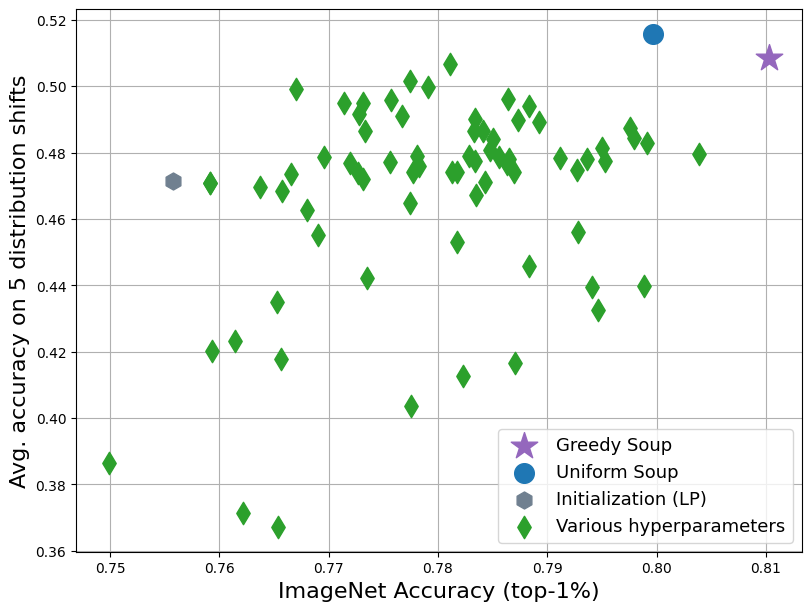

# [Model soups](https://arxiv.org/abs/2203.05482): An Unofficial PyTorch Implementation

This repo is a modification of the [official model soups repo](https://github.com/mlfoundations/model-soups). Please follow their [instructions](https://github.com/mlfoundations/model-soups#install-dependencies-and-downloading-datasets) for installing any additional or conflicting requirements.

<p align="center">

</p>


## Training the Models in a Soup

The bash commands used for training a model soup on ImageNet, iWildCam, or Camelyon can be found [here](https://github.com/ksarangmath/model-soups/tree/main/commands). They are named with the format `train_soup_{dataset}.sh`. We summarize some of the important flags for experimentation below:

* `fname`: Specifies the path to the config file, which specifies necessary metadata to run the soup experiments
* `folder`: Directory to save the logs to
* `soup_size`: Specifies the number of models in the model soup to train

In the config file that `fname` refers to, we summarize some of the important flags below:

* `root_path`: Path of root directory of datasets
* `image_folder`: Path of dataset used in experiment
* `nb_classes`: Number of classes in dataset
* `pretrained_path`: Path to initial model weights
* `subset_file`: Name of subset being used for training
* `model_location`: Path where models will be saved
* `name`: Name of experiment, will be used to name the models
* `model_name`: Name of model architecture


## Creating Soups

The template for creating a uniform soup can be seen [here](https://github.com/ksarangmath/model-soups/blob/main/commands/create_uniform_soup.sh).

The template for creating a greedy soup can be seen [here](https://github.com/ksarangmath/model-soups/blob/main/commands/create_greedy_soup.sh).

In either script, use the `model-location` flag to specify the path where the models for a soup are stored. For ImageNet Greedy Soup experiments, set `greedy-soup-key` to id_val_top1, and for iWildCam and Camelyon experiments, set the value to id_val_avg.

The uniform and greedy soups will be stored at `model-location`.


## Evaluation of Soups on OOD Shifts

The model soup weights can be loaded and evaluated from [this repository](https://github.com/Aaditya-Singh/Low-Shot-Robustness). 


## Bibtex

Please cite the original authors if you find this repository helpful:
```bibtex
@InProceedings{pmlr-v162-wortsman22a,
  title = 	 {Model soups: averaging weights of multiple fine-tuned models improves accuracy without increasing inference time},
  author =       {Wortsman, Mitchell and Ilharco, Gabriel and Gadre, Samir Ya and Roelofs, Rebecca and Gontijo-Lopes, Raphael and Morcos, Ari S and Namkoong, Hongseok and Farhadi, Ali and Carmon, Yair and Kornblith, Simon and Schmidt, Ludwig},
  booktitle = 	 {Proceedings of the 39th International Conference on Machine Learning},
  pages = 	 {23965--23998},
  year = 	 {2022},
  editor = 	 {Chaudhuri, Kamalika and Jegelka, Stefanie and Song, Le and Szepesvari, Csaba and Niu, Gang and Sabato, Sivan},
  volume = 	 {162},
  series = 	 {Proceedings of Machine Learning Research},
  month = 	 {17--23 Jul},
  publisher =    {PMLR},
  pdf = 	 {https://proceedings.mlr.press/v162/wortsman22a/wortsman22a.pdf},
  url = 	 {https://proceedings.mlr.press/v162/wortsman22a.html}
}


```
